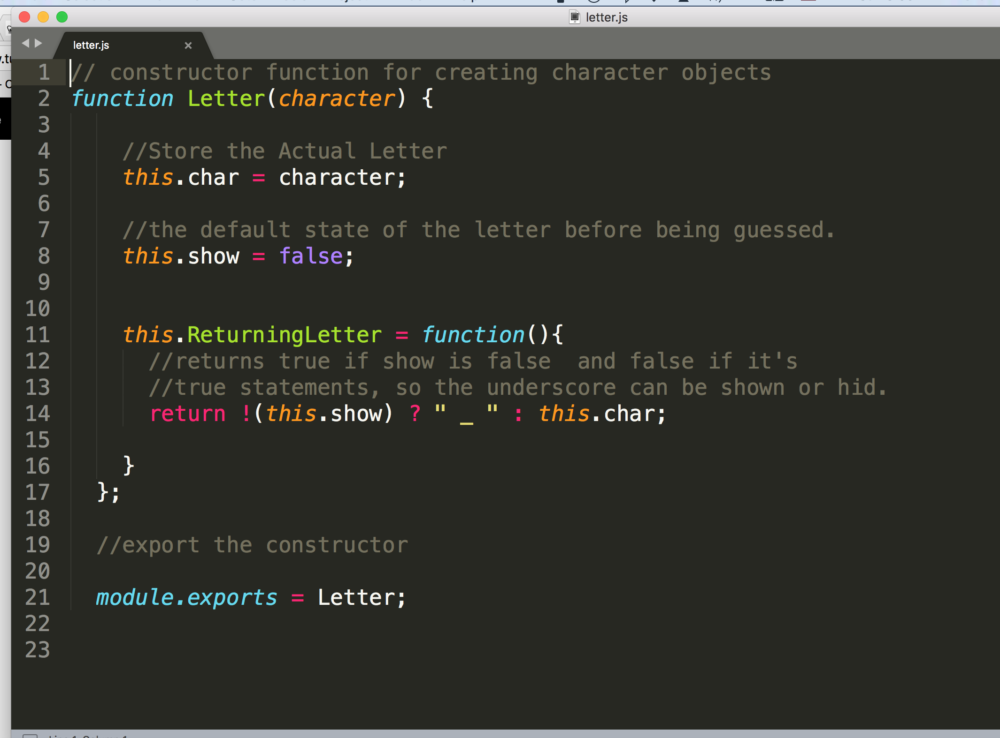

# constructor

<h1>
Hangman Constructor
</h1>

<h2>
Introduction
</h2>

So, this exercise gives us a glimps about object oriented programming. JavaScript is an excellent language to compose OOP web applications. In this exercise we will be exposed to Node.JS module exports. The Module export is a special object which is included in other JS files in the Node.JS application. It is a representation of the constructor that will serve a partial role in the overall application. 

<h1>
Letter.JS
</h1>

In Letter.JS, the character is stored, then we give it a default boolean state, in this case it is false. Then a function that will replace each letter with an underscore unless it is guess. At this point, the letter will be shown and it will not be represented by an underscore.

